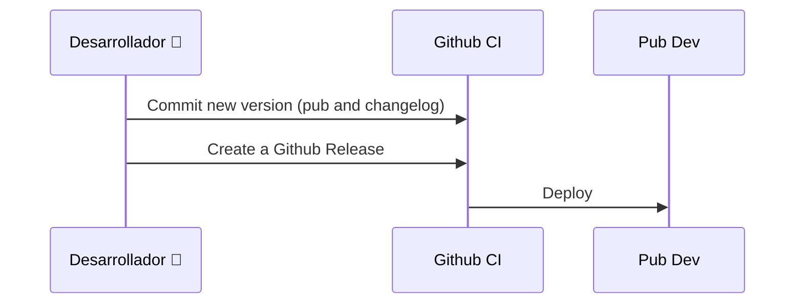

# Deploys 
Each version will be described on:
- [Github Releases](https://github.com/la-haus/flutter-segment/releases)
- [CHANGELOG.md](https://github.com/la-haus/flutter-segment/blob/master/CHANGELOG.md)

## How to

